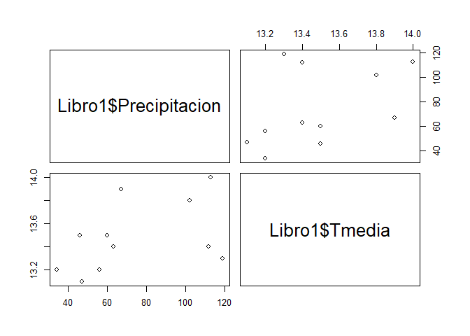
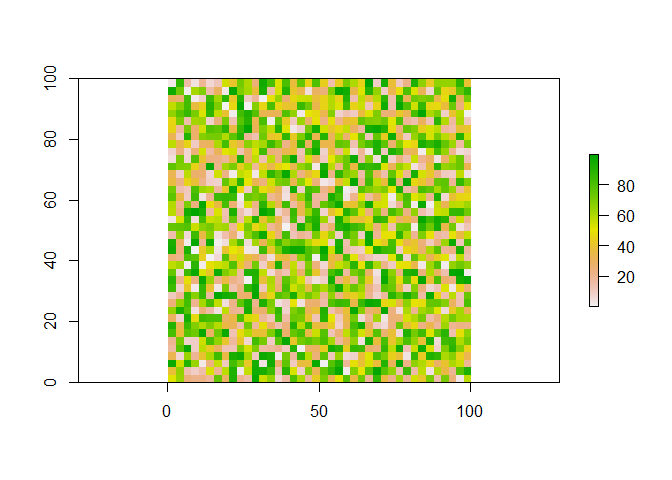

Exploración de datos con R Package
================

``` r
#Institucion: Programa de Ingenieria en Topografia de las Unidades Tecnológicas de Santander

# autor: "Aponte Saravia Jhonathan"
```

## Introducción

En este proceso se intenta de presentar procesos de acercamiento de con
el programa R Package,

## Desarrollo del proceso

#### Operaciones basicas con R

``` r
Primer_valor <- 25
Primer_valor
```

    ## [1] 25

``` r
Segundo_valor <- 27
Segundo_valor
```

    ## [1] 27

``` r
#  sumando  y restando valores 
suma <- Primer_valor + Segundo_valor
suma
```

    ## [1] 52

``` r
difer <- Primer_valor - Segundo_valor
difer
```

    ## [1] -2

``` r
# multiplicando valores 

producto <- Primer_valor*Segundo_valor
producto
```

    ## [1] 675

``` r
# valor abosulto 

absoluto <- abs(Primer_valor - Segundo_valor)
absoluto
```

    ## [1] 2

``` r
# potenciación 
pot<-absoluto^16
pot
```

    ## [1] 65536

#### Explorando datos

``` r
prec<- c(34,46 ,    67, 113,    102,    63, 47, 47, 56, 119,    112,    60) 
mes<-c("enero", "febrero","marzo", "abril", "mayo", "junio","julio","agosto", "septiembre", "octubre","noviembre","diciembre")
# mostrando las caracteristicas de los datos
 class(prec)
```

    ## [1] "numeric"

``` r
 class(mes)
```

    ## [1] "character"

``` r
# explorando losvalores estadisticos del conjunto 
summary(prec)
```

    ##    Min. 1st Qu.  Median    Mean 3rd Qu.    Max. 
    ##   34.00   47.00   61.50   72.17  104.50  119.00

``` r
#Mostrando el conjuto de valores 
print(prec)
```

    ##  [1]  34  46  67 113 102  63  47  47  56 119 112  60

``` r
# graficando los datos
plot(prec)
```

<!-- -->

``` r
#Calculo de valores máximos y mínimos. 
max(prec)
```

    ## [1] 119

``` r
min(prec)
```

    ## [1] 34

#### Importando y explorando datos desde excel

El proceso de importacion de datos tipo tabla desde excel y/o otros
formatos, es bastante sencillo, para ello nos ubicamos en la opción de
importar datos desde excel, y ruteamos el directorio donde se encuentra
el archivo, o importamos con el codigo de read\_excel(), ubicamos la
ruta donde se enceuntra el archivo. como se muestra a continuación:

``` r
library(readxl)
#Libro1 < read_excel("......./direccion/Libro1.xlsx")
```

``` r
#Exploramos los datos
head(Libro1)
```

    ## # A tibble: 6 x 5
    ##   mes     Tmedia  Tmin  Tmax Precipitacion
    ##   <chr>    <dbl> <dbl> <dbl>         <dbl>
    ## 1 enero     13.2   7.2  19.2            34
    ## 2 febrero   13.5   7.6  19.4            46
    ## 3 marzo     13.9   8.6  19.3            67
    ## 4 abril     14     9.2  18.4           113
    ## 5 mayo      13.8   9.1  17.8           102
    ## 6 junio     13.4   8.7  17.6            63

``` r
# Exploramos los valores estadisticos
summary(Libro1)
```

    ##      mes                Tmedia           Tmin            Tmax      
    ##  Length:12          Min.   :13.10   Min.   :7.200   Min.   :17.60  
    ##  Class :character   1st Qu.:13.20   1st Qu.:8.075   1st Qu.:18.10  
    ##  Mode  :character   Median :13.40   Median :8.500   Median :18.40  
    ##                     Mean   :13.45   Mean   :8.358   Mean   :18.47  
    ##                     3rd Qu.:13.57   3rd Qu.:8.625   3rd Qu.:18.90  
    ##                     Max.   :14.00   Max.   :9.200   Max.   :19.40  
    ##  Precipitacion   
    ##  Min.   : 34.00  
    ##  1st Qu.: 47.00  
    ##  Median : 61.50  
    ##  Mean   : 72.17  
    ##  3rd Qu.:104.50  
    ##  Max.   :119.00

``` r
#Calculamos valores temperatura superiores a 16 °C
Libro1[Libro1$Tmax > 16,]
```

    ## # A tibble: 12 x 5
    ##    mes        Tmedia  Tmin  Tmax Precipitacion
    ##    <chr>       <dbl> <dbl> <dbl>         <dbl>
    ##  1 enero        13.2   7.2  19.2            34
    ##  2 febrero      13.5   7.6  19.4            46
    ##  3 marzo        13.9   8.6  19.3            67
    ##  4 abril        14     9.2  18.4           113
    ##  5 mayo         13.8   9.1  17.8           102
    ##  6 junio        13.4   8.7  17.6            63
    ##  7 julio        13.1   8.5  17.8            47
    ##  8 agosto       13.1   8.2  18.2            47
    ##  9 septiembre   13.2   8.5  18.2            56
    ## 10 octubre      13.3   8.6  18.4           119
    ## 11 noviembre    13.4   8    18.5           112
    ## 12 diciembre    13.5   8.1  18.8            60

``` r
#Calculamos valores precipitacion superiores a 50mm
Libro1[Libro1$Precipitacion > 50,]
```

    ## # A tibble: 8 x 5
    ##   mes        Tmedia  Tmin  Tmax Precipitacion
    ##   <chr>       <dbl> <dbl> <dbl>         <dbl>
    ## 1 marzo        13.9   8.6  19.3            67
    ## 2 abril        14     9.2  18.4           113
    ## 3 mayo         13.8   9.1  17.8           102
    ## 4 junio        13.4   8.7  17.6            63
    ## 5 septiembre   13.2   8.5  18.2            56
    ## 6 octubre      13.3   8.6  18.4           119
    ## 7 noviembre    13.4   8    18.5           112
    ## 8 diciembre    13.5   8.1  18.8            60

``` r
#Graficamos el comportamiento de la precipitacion 
plot(Libro1$Precipitacion) 
```

<!-- -->

``` r
#Graficamos el comportamiento de la precipitacion en histogramas.
hist(Libro1$Precipitacion)
```

<!-- -->

``` r
# Generamos procesos de  correlación entre los valores  por el método de pearson y spearman
#Método de pearson
cor(Libro1$Precipitacion, Libro1$Tmedia, method = "pearson")
```

    ## [1] 0.4988904

``` r
#Método de spearman
cor(Libro1$Precipitacion, Libro1$Tmedia, method = "spearman")
```

    ## [1] 0.5149984

``` r
# Generamos los procesos de  regresion lineal entre la precipitacion y la temperatura media
reg <-lm(Libro1$Precipitacion ~ Libro1$Tmedia)

# Resumen del proceso de regresión.
summary(reg)
```

    ## 
    ## Call:
    ## lm(formula = Libro1$Precipitacion ~ Libro1$Tmedia)
    ## 
    ## Residuals:
    ##     Min      1Q  Median      3Q     Max 
    ## -28.657 -17.422  -7.206  12.661  54.304 
    ## 
    ## Coefficients:
    ##               Estimate Std. Error t value Pr(>|t|)  
    ## (Intercept)    -597.72     368.09  -1.624   0.1355  
    ## Libro1$Tmedia    49.81      27.36   1.820   0.0987 .
    ## ---
    ## Signif. codes:  0 '***' 0.001 '**' 0.01 '*' 0.05 '.' 0.1 ' ' 1
    ## 
    ## Residual standard error: 27.77 on 10 degrees of freedom
    ## Multiple R-squared:  0.2489, Adjusted R-squared:  0.1738 
    ## F-statistic: 3.314 on 1 and 10 DF,  p-value: 0.09872

``` r
pairs(Libro1$Precipitacion ~ Libro1$Tmedia)

library(PerformanceAnalytics)
```

    ## Loading required package: xts

    ## Loading required package: zoo

    ## 
    ## Attaching package: 'zoo'

    ## The following objects are masked from 'package:base':
    ## 
    ##     as.Date, as.Date.numeric

    ## Registered S3 method overwritten by 'xts':
    ##   method     from
    ##   as.zoo.xts zoo

    ## 
    ## Attaching package: 'PerformanceAnalytics'

    ## The following object is masked from 'package:graphics':
    ## 
    ##     legend

<!-- -->

``` r
dat1<-data.frame(Libro1$Precipitacion, Libro1$Tmedia)

chart.Correlation(dat1)
```

<!-- --> \#\#\#
Explorando datos vectoriales

#### Creando datos vectoriales tipo punto

Para realizar los procesos de exploracion y creacion de datos
vectoriales se debe isntalar la libreria: library(sf)

``` r
library(sf)
```

    ## Linking to GEOS 3.8.0, GDAL 3.0.4, PROJ 6.3.1

``` r
library(rgdal)
```

    ## Loading required package: sp

    ## rgdal: version: 1.4-8, (SVN revision 845)
    ##  Geospatial Data Abstraction Library extensions to R successfully loaded
    ##  Loaded GDAL runtime: GDAL 2.2.3, released 2017/11/20
    ##  Path to GDAL shared files: C:/Users/Usuario/Documents/R/win-library/3.6/rgdal/gdal
    ##  GDAL binary built with GEOS: TRUE 
    ##  Loaded PROJ.4 runtime: Rel. 4.9.3, 15 August 2016, [PJ_VERSION: 493]
    ##  Path to PROJ.4 shared files: C:/Users/Usuario/Documents/R/win-library/3.6/rgdal/proj
    ##  Linking to sp version: 1.4-1

#### Creando un dato vectorial tipo punto (punto unico)

``` r
p <- st_point(c(707203.42,785800.53,933),"XYZ")
class(p)
```

    ## [1] "XYZ"   "POINT" "sfg"

``` r
str(p)
```

    ##  'XYZ' num [1:3] 707203 785801 933

``` r
# Mostrando el punto el las coordenadas
plot(p, axes = "TRUE")
```

<!-- --> \#\#\#\#
Creando varios puntos

``` r
# Ingresando los valores en el eje de las abcisas y ordenadas y los valores de altitud.
X <- c (707211.25,707272.60,707281.55,707339.70,707328.83,707284.91,
                  707279.60,707214.99,707184.29,707198.97,707203.01)

Y <- c(785848.80,785835.89,785869.49,785856.82,785813.29,785775.19,
                  785741.15,785699.51,785718.96,785791.30,785817.58)

Z <-c (930,931,931,932,932,932,932,931,929,930,930)

#Integrando los valores en la tabla.
coord <- cbind(X,Y)

#Contenido de los datos
print(coord)
```

    ##              X        Y
    ##  [1,] 707211.2 785848.8
    ##  [2,] 707272.6 785835.9
    ##  [3,] 707281.6 785869.5
    ##  [4,] 707339.7 785856.8
    ##  [5,] 707328.8 785813.3
    ##  [6,] 707284.9 785775.2
    ##  [7,] 707279.6 785741.2
    ##  [8,] 707215.0 785699.5
    ##  [9,] 707184.3 785719.0
    ## [10,] 707199.0 785791.3
    ## [11,] 707203.0 785817.6

``` r
class(coord)
```

    ## [1] "matrix"

``` r
str(coord)
```

    ##  num [1:11, 1:2] 707211 707273 707282 707340 707329 ...
    ##  - attr(*, "dimnames")=List of 2
    ##   ..$ : NULL
    ##   ..$ : chr [1:2] "X" "Y"

``` r
# Mostrando la distribucion de los  puntos en el eje cartesiano
plot(coord, axes = TRUE)
```

<!-- -->

#### Creando multipuntos

#### Opcion 1

``` r
#Agregando el valor de la coordenada en el eje Z
XYZ <- cbind(coord,Z)
XYZ
```

    ##              X        Y   Z
    ##  [1,] 707211.2 785848.8 930
    ##  [2,] 707272.6 785835.9 931
    ##  [3,] 707281.6 785869.5 931
    ##  [4,] 707339.7 785856.8 932
    ##  [5,] 707328.8 785813.3 932
    ##  [6,] 707284.9 785775.2 932
    ##  [7,] 707279.6 785741.2 932
    ##  [8,] 707215.0 785699.5 931
    ##  [9,] 707184.3 785719.0 929
    ## [10,] 707199.0 785791.3 930
    ## [11,] 707203.0 785817.6 930

``` r
# generando multipunto
mp<-st_multipoint(XYZ)
mp
```

    ## MULTIPOINT Z ((707211.2 785848.8 930), (707272.6 785835.9 931), (707281.6 785869.5 931), (707339.7 785856.8 932), (707328.8 785813.3 932), (707284.9 785775.2 932), (707279.6 785741.2 932), (707215 785699.5 931), (707184.3 785719 929), (707199 785791.3 930), (707203 785817.6 930))

``` r
# Presentando la distribución de los puntos en el eje cartesiano
plot(mp, axes = "TRUE")
```

<!-- -->

``` r
# calculando el centriode de los puntos.
cen <-st_centroid(mp)
cen
```

    ## POINT (707254.5 785797.1)

#### Opcion 2

``` r
v1 <- st_point(c(707211.25,785848.80),"XY")
v2 <- st_point(c(707272.60,785835.89),"XY")
v3 <- st_point(c(707281.55,785869.49),"XY")
v4 <- st_point(c(707339.70,785856.82),"XY")
v5 <- st_point(c(707328.83,785813.29),"XY")
v6 <- st_point(c(707284.91,785775.19),"XY")
v7 <- st_point(c(707279.60,785741.15),"XY")
v8 <- st_point(c(707214.99,785699.51),"XY")
v9 <- st_point(c(707184.29,785718.96),"XY")
v10 <- st_point(c(707198.97,785791.30),"XY")
v11 <- st_point(c(707203.01,785817.58),"XY")

geom <- st_sfc(v1,v2,v3,v4,v5,v6,v7, v8, v9,v10,v11)

str(geom)
```

    ## sfc_POINT of length 11; first list element:  'XY' num [1:2] 707211 785849

``` r
summary(geom)
```

    ##   POINT epsg:NA 
    ##      11       0

``` r
plot(geom)
```

<!-- -->

``` r
plot(geom, axes = "TRUE")
```

<!-- -->

##### Asociado la geometría con la tabla de atributos

``` r
num <- c(1,2,3,4,5,6,7,8,9,10,11)
nomb <- c("v1", "v2", "v3","v4","v5","v6","v7","v8","v9","v10","v11")

#generando la data frame
tabpuntos <- data.frame(cbind(num, nomb))

summary(tabpuntos)
```

    ##       num         nomb  
    ##  1      :1   v1     :1  
    ##  10     :1   v10    :1  
    ##  11     :1   v11    :1  
    ##  2      :1   v2     :1  
    ##  3      :1   v3     :1  
    ##  4      :1   v4     :1  
    ##  (Other):5   (Other):5

``` r
class(tabpuntos)
```

    ## [1] "data.frame"

``` r
print(tabpuntos)
```

    ##    num nomb
    ## 1    1   v1
    ## 2    2   v2
    ## 3    3   v3
    ## 4    4   v4
    ## 5    5   v5
    ## 6    6   v6
    ## 7    7   v7
    ## 8    8   v8
    ## 9    9   v9
    ## 10  10  v10
    ## 11  11  v11

``` r
SFP <- st_sf(tabpuntos$nomb, geometry = geom)

plot(SFP, axes = "TRUE")
```

<!-- -->

#### Generando datos tipo linea

``` r
# Construcción de la primera red  

X1s <- c(604940.00,605144.00,605174.00,605485.00,605602.00,605659.00)
Y1s <- c(533681.00,533539.00,533509.00,533316.00,533248.00,533205.00)

Coord1 <- cbind(X1s,Y1s)

L1 <- st_linestring(Coord1)

class(L1)
```

    ## [1] "XY"         "LINESTRING" "sfg"

``` r
plot(L1, axes= "TRUE")
```

<!-- -->

``` r
# Construcción de la segunda red

X2s <- c(605241.00,605091.07,604940.00)
Y2s <- c(534005.00,533821.04,533681.00)
Coord2 <- cbind(X2s,Y2s)
L2 <- st_linestring(Coord2)
plot(L2, axes= "TRUE")
```

<!-- -->

``` r
# Construcción de la tercera red
X3s <- c(605293.00,605226.76,605144.00)
Y3s <- c(533847.00,533750.51,533539.00)
Coord3 <- cbind(X3s,Y3s)

L3 <- st_linestring(Coord3)
plot(L3, axes= "TRUE")
```

<!-- -->

``` r
# Construcción de cuarta red

X4s <- c(605185.00,605162.84,605174.00)
Y4s <- c(533305.00,533414.66,533509.00)
Coord4 <- cbind(X4s,Y4s)

L4 <- st_linestring(Coord4)

plot(L4, axes= "TRUE")
```

<!-- -->

``` r
#Integrando todas las redes o las lineas vectoriales. 
geometria2 <- st_sfc(L1,L2,L3,L4)

plot(geometria2, axes=TRUE)
```

<!-- -->

``` r
# Tabla de atributos
num <- c(1,2,3,4)
code <- c("Vp","Vs1","Vs2","Vs3")
tipo <- c("ViaP","Trocha1","trocha2","trocha3")
tablineas <- data.frame(cbind(num,tipo,code))

SFL <- st_sf(tablineas$tipo, geometry = geometria2)
plot(SFL,axes=TRUE)
```

<!-- -->

#### Generando datos tipo poligono

``` r
# primer poligono

X1 <- c(707211.25,707272.60,707281.55,707339.70,707328.83,707284.91,
         707279.60,707214.99,707184.29,707198.97,707203.01,707211.25)
Y1 <- c(785848.80,785835.89,785869.49,785856.82,785813.29,785775.19,
         785741.15,785699.51,785718.96,785791.30,785817.58,785848.80)

coord1 <- cbind(X1,Y1)

poli <- st_polygon(list(coord1))
plot(poli, axes = T)
```

<!-- -->

``` r
#segundo poligono

x2 <-c(707216.19,707285.82,707279.79,707212.53,707216.19)
y2 <-c(785816.28,785803.90,785777.12,785788.84,785816.28)
coord2 <- cbind(x2,y2)

poli2 <- st_polygon(list(coord2))

plot(poli2, axes = T)
```

<!-- -->

``` r
#Tercer poligono

X3 <- c (707272.60,707281.55,707339.70,707328.83,707272.60)
Y3 <- c(785835.89,785869.49,785856.82,785813.29,785835.89)

coord3 <- cbind(X3,Y3)

poli3 <- st_polygon(list(coord3))

plot(poli3, axes = T)
```

<!-- -->

``` r
# Integrando los poligonos

p2 <- st_polygon(list(coord1,coord2,coord3))
plot(p2, axes = T)
```

<!-- -->

``` r
geometria <- st_sfc(poli,poli2,poli3)

#Generando la tabla de atributos.
ID <- c(1,2,3)
Cod <- c("Ac", "NC","EC")
Tipo <- c("Area construida", "No construida", "En construccion")
tabpol <- data.frame(cbind(ID,Cod,Tipo))

# Uniendo los atributos con el vector 
SFpol <- st_sf(tabpol$Tipo, geometry = geometria )
plot(SFpol, axes = T)
```

<!-- -->

``` r
as.data.frame(SFpol)
```

    ##   structure(c(1L, 3L, 2L), .Label = c("Area construida", "En construccion", 
    ## 1                                                            Area construida
    ## 2                                                              No construida
    ## 3                                                            En construccion
    ##                         geometry
    ## 1 POLYGON ((707211.2 785848.8...
    ## 2 POLYGON ((707216.2 785816.3...
    ## 3 POLYGON ((707272.6 785835.9...

``` r
print(SFpol[Cod=="EC",])
```

    ## Simple feature collection with 1 feature and 1 field
    ## geometry type:  POLYGON
    ## dimension:      XY
    ## bbox:           xmin: 707272.6 ymin: 785813.3 xmax: 707339.7 ymax: 785869.5
    ## CRS:            NA
    ##   structure(c(1L, 3L, 2L), .Label = c("Area construida", "En construccion", 
    ## 3                                                            En construccion
    ##                         geometry
    ## 3 POLYGON ((707272.6 785835.9...

``` r
nocosntr<-(SFpol[Cod=="EC",])

plot(st_geometry(SFpol), axes=TRUE);plot(nocosntr,add=TRUE,col = "BLUE");
```

<!-- -->

``` r
# calculo de  algunas alpicaciones 
#superficie y perimetro.

sup <-st_area(poli3)
sup
```

    ## [1] 2380.295

``` r
# calculo de Perimetro 
bound<-st_boundary(poli3)
bound
```

    ## LINESTRING (707272.6 785835.9, 707281.6 785869.5, 707339.7 785856.8, 707328.8 785813.3, 707272.6 785835.9)

``` r
long <-st_length(bound)
long
```

    ## [1] 199.7543

``` r
# centroide
centroi<-st_centroid(poli3)
centroi
```

    ## POINT (707306.9 785843.5)

``` r
# cálculo de Buffers 
buf <-st_buffer(poli3, dist=5)

geom <- st_sfc(poli3, buf)

plot(geom, axes = T, border = "blue")
```

<!-- -->

``` r
# generando las coordenadas del poligono.

cord <-st_coordinates(buf) 
cord
```

    ##               X        Y L1 L2
    ##   [1,] 707270.7 785831.3  1  1
    ##   [2,] 707270.5 785831.4  1  1
    ##   [3,] 707270.3 785831.5  1  1
    ##   [4,] 707270.0 785831.6  1  1
    ##   [5,] 707269.8 785831.7  1  1
    ##   [6,] 707269.6 785831.9  1  1
    ##   [7,] 707269.4 785832.0  1  1
    ##   [8,] 707269.2 785832.2  1  1
    ##   [9,] 707269.0 785832.4  1  1
    ##  [10,] 707268.9 785832.6  1  1
    ##  [11,] 707268.7 785832.8  1  1
    ##  [12,] 707268.5 785833.0  1  1
    ##  [13,] 707268.4 785833.2  1  1
    ##  [14,] 707268.3 785833.4  1  1
    ##  [15,] 707268.1 785833.7  1  1
    ##  [16,] 707268.0 785833.9  1  1
    ##  [17,] 707267.9 785834.1  1  1
    ##  [18,] 707267.8 785834.4  1  1
    ##  [19,] 707267.8 785834.6  1  1
    ##  [20,] 707267.7 785834.9  1  1
    ##  [21,] 707267.7 785835.1  1  1
    ##  [22,] 707267.6 785835.4  1  1
    ##  [23,] 707267.6 785835.6  1  1
    ##  [24,] 707267.6 785835.9  1  1
    ##  [25,] 707267.6 785836.2  1  1
    ##  [26,] 707267.6 785836.4  1  1
    ##  [27,] 707267.7 785836.7  1  1
    ##  [28,] 707267.7 785836.9  1  1
    ##  [29,] 707267.8 785837.2  1  1
    ##  [30,] 707276.7 785870.8  1  1
    ##  [31,] 707276.8 785871.0  1  1
    ##  [32,] 707276.9 785871.3  1  1
    ##  [33,] 707277.0 785871.5  1  1
    ##  [34,] 707277.1 785871.8  1  1
    ##  [35,] 707277.2 785872.0  1  1
    ##  [36,] 707277.4 785872.2  1  1
    ##  [37,] 707277.5 785872.4  1  1
    ##  [38,] 707277.7 785872.6  1  1
    ##  [39,] 707277.8 785872.8  1  1
    ##  [40,] 707278.0 785873.0  1  1
    ##  [41,] 707278.2 785873.2  1  1
    ##  [42,] 707278.4 785873.4  1  1
    ##  [43,] 707278.6 785873.5  1  1
    ##  [44,] 707278.8 785873.7  1  1
    ##  [45,] 707279.1 785873.8  1  1
    ##  [46,] 707279.3 785873.9  1  1
    ##  [47,] 707279.5 785874.1  1  1
    ##  [48,] 707279.8 785874.2  1  1
    ##  [49,] 707280.0 785874.2  1  1
    ##  [50,] 707280.3 785874.3  1  1
    ##  [51,] 707280.5 785874.4  1  1
    ##  [52,] 707280.8 785874.4  1  1
    ##  [53,] 707281.0 785874.5  1  1
    ##  [54,] 707281.3 785874.5  1  1
    ##  [55,] 707281.6 785874.5  1  1
    ##  [56,] 707281.8 785874.5  1  1
    ##  [57,] 707282.1 785874.5  1  1
    ##  [58,] 707282.4 785874.4  1  1
    ##  [59,] 707282.6 785874.4  1  1
    ##  [60,] 707340.8 785861.7  1  1
    ##  [61,] 707341.0 785861.6  1  1
    ##  [62,] 707341.3 785861.6  1  1
    ##  [63,] 707341.5 785861.5  1  1
    ##  [64,] 707341.7 785861.4  1  1
    ##  [65,] 707342.0 785861.3  1  1
    ##  [66,] 707342.2 785861.1  1  1
    ##  [67,] 707342.4 785861.0  1  1
    ##  [68,] 707342.6 785860.9  1  1
    ##  [69,] 707342.8 785860.7  1  1
    ##  [70,] 707343.0 785860.5  1  1
    ##  [71,] 707343.2 785860.4  1  1
    ##  [72,] 707343.4 785860.2  1  1
    ##  [73,] 707343.6 785860.0  1  1
    ##  [74,] 707343.7 785859.8  1  1
    ##  [75,] 707343.9 785859.6  1  1
    ##  [76,] 707344.0 785859.3  1  1
    ##  [77,] 707344.1 785859.1  1  1
    ##  [78,] 707344.3 785858.9  1  1
    ##  [79,] 707344.4 785858.7  1  1
    ##  [80,] 707344.4 785858.4  1  1
    ##  [81,] 707344.5 785858.2  1  1
    ##  [82,] 707344.6 785857.9  1  1
    ##  [83,] 707344.6 785857.7  1  1
    ##  [84,] 707344.7 785857.4  1  1
    ##  [85,] 707344.7 785857.1  1  1
    ##  [86,] 707344.7 785856.9  1  1
    ##  [87,] 707344.7 785856.6  1  1
    ##  [88,] 707344.7 785856.4  1  1
    ##  [89,] 707344.7 785856.1  1  1
    ##  [90,] 707344.6 785855.9  1  1
    ##  [91,] 707344.6 785855.6  1  1
    ##  [92,] 707333.7 785812.1  1  1
    ##  [93,] 707333.6 785811.8  1  1
    ##  [94,] 707333.5 785811.6  1  1
    ##  [95,] 707333.4 785811.3  1  1
    ##  [96,] 707333.3 785811.1  1  1
    ##  [97,] 707333.2 785810.9  1  1
    ##  [98,] 707333.1 785810.7  1  1
    ##  [99,] 707332.9 785810.4  1  1
    ## [100,] 707332.8 785810.2  1  1
    ## [101,] 707332.6 785810.0  1  1
    ## [102,] 707332.4 785809.8  1  1
    ## [103,] 707332.3 785809.7  1  1
    ## [104,] 707332.1 785809.5  1  1
    ## [105,] 707331.9 785809.3  1  1
    ## [106,] 707331.7 785809.2  1  1
    ## [107,] 707331.4 785809.0  1  1
    ## [108,] 707331.2 785808.9  1  1
    ## [109,] 707331.0 785808.8  1  1
    ## [110,] 707330.8 785808.7  1  1
    ## [111,] 707330.5 785808.6  1  1
    ## [112,] 707330.3 785808.5  1  1
    ## [113,] 707330.0 785808.4  1  1
    ## [114,] 707329.8 785808.4  1  1
    ## [115,] 707329.5 785808.3  1  1
    ## [116,] 707329.2 785808.3  1  1
    ## [117,] 707329.0 785808.3  1  1
    ## [118,] 707328.7 785808.3  1  1
    ## [119,] 707328.5 785808.3  1  1
    ## [120,] 707328.2 785808.3  1  1
    ## [121,] 707328.0 785808.4  1  1
    ## [122,] 707327.7 785808.4  1  1
    ## [123,] 707327.5 785808.5  1  1
    ## [124,] 707327.2 785808.6  1  1
    ## [125,] 707327.0 785808.7  1  1
    ## [126,] 707270.7 785831.3  1  1

### Crear datos tipo raster.

``` r
library(raster)

m <- matrix(c(runif(1600, min=0, max=100)), ncol = 40, nrow = 40,byrow = TRUE )

summary(m)
```

    ##        V1               V2               V3                V4         
    ##  Min.   : 3.946   Min.   : 1.864   Min.   : 0.1521   Min.   : 0.7157  
    ##  1st Qu.:43.860   1st Qu.:24.211   1st Qu.:17.9398   1st Qu.:37.7190  
    ##  Median :64.551   Median :44.759   Median :42.5018   Median :57.2575  
    ##  Mean   :59.714   Mean   :44.828   Mean   :43.6542   Mean   :56.5861  
    ##  3rd Qu.:77.376   3rd Qu.:68.528   3rd Qu.:68.2261   3rd Qu.:79.5815  
    ##  Max.   :99.002   Max.   :99.369   Max.   :99.4959   Max.   :99.7772  
    ##        V5               V6              V7               V8         
    ##  Min.   : 3.406   Min.   : 2.52   Min.   : 1.245   Min.   : 0.8224  
    ##  1st Qu.:39.658   1st Qu.:24.23   1st Qu.:24.900   1st Qu.:24.7563  
    ##  Median :64.225   Median :53.25   Median :44.809   Median :57.5020  
    ##  Mean   :59.323   Mean   :48.16   Mean   :49.940   Mean   :53.1209  
    ##  3rd Qu.:84.938   3rd Qu.:69.22   3rd Qu.:75.181   3rd Qu.:77.4658  
    ##  Max.   :96.382   Max.   :92.58   Max.   :98.434   Max.   :99.2197  
    ##        V9              V10              V11              V12         
    ##  Min.   : 1.547   Min.   : 1.323   Min.   : 2.242   Min.   : 0.9925  
    ##  1st Qu.:27.234   1st Qu.:21.885   1st Qu.:25.994   1st Qu.:31.9078  
    ##  Median :49.779   Median :40.177   Median :59.070   Median :48.4478  
    ##  Mean   :51.770   Mean   :46.063   Mean   :51.491   Mean   :50.1825  
    ##  3rd Qu.:77.884   3rd Qu.:68.985   3rd Qu.:65.420   3rd Qu.:70.0409  
    ##  Max.   :99.565   Max.   :98.733   Max.   :97.701   Max.   :96.1898  
    ##       V13              V14              V15              V16        
    ##  Min.   : 1.207   Min.   : 6.117   Min.   : 2.338   Min.   : 2.146  
    ##  1st Qu.:12.597   1st Qu.:27.402   1st Qu.:27.529   1st Qu.:38.609  
    ##  Median :46.134   Median :49.551   Median :48.802   Median :59.340  
    ##  Mean   :46.626   Mean   :49.134   Mean   :48.436   Mean   :56.591  
    ##  3rd Qu.:75.525   3rd Qu.:71.890   3rd Qu.:63.882   3rd Qu.:77.809  
    ##  Max.   :99.676   Max.   :98.798   Max.   :98.278   Max.   :97.151  
    ##       V17               V18             V19              V20        
    ##  Min.   : 0.6565   Min.   : 2.72   Min.   : 5.306   Min.   : 2.824  
    ##  1st Qu.:27.8336   1st Qu.:47.39   1st Qu.:27.153   1st Qu.:17.980  
    ##  Median :56.2466   Median :67.27   Median :55.356   Median :46.909  
    ##  Mean   :53.8334   Mean   :64.11   Mean   :51.021   Mean   :47.871  
    ##  3rd Qu.:78.8057   3rd Qu.:89.38   3rd Qu.:71.158   3rd Qu.:71.998  
    ##  Max.   :97.7444   Max.   :97.60   Max.   :99.496   Max.   :96.122  
    ##       V21              V22             V23              V24        
    ##  Min.   : 2.939   Min.   : 3.94   Min.   : 5.548   Min.   : 1.916  
    ##  1st Qu.:26.548   1st Qu.:20.60   1st Qu.:24.062   1st Qu.:26.513  
    ##  Median :53.022   Median :48.46   Median :48.809   Median :55.241  
    ##  Mean   :50.396   Mean   :49.03   Mean   :48.486   Mean   :53.471  
    ##  3rd Qu.:70.113   3rd Qu.:69.93   3rd Qu.:71.361   3rd Qu.:77.303  
    ##  Max.   :97.323   Max.   :97.89   Max.   :90.256   Max.   :99.125  
    ##       V25               V26              V27              V28        
    ##  Min.   : 0.6237   Min.   : 4.935   Min.   : 2.321   Min.   : 1.456  
    ##  1st Qu.:27.1414   1st Qu.:22.757   1st Qu.:33.082   1st Qu.:37.955  
    ##  Median :52.4010   Median :46.239   Median :57.416   Median :63.735  
    ##  Mean   :49.9645   Mean   :49.175   Mean   :52.058   Mean   :57.322  
    ##  3rd Qu.:76.1177   3rd Qu.:71.841   3rd Qu.:72.530   3rd Qu.:82.334  
    ##  Max.   :97.3128   Max.   :98.543   Max.   :91.823   Max.   :99.785  
    ##       V29              V30              V31               V32        
    ##  Min.   : 1.327   Min.   : 3.249   Min.   : 0.5901   Min.   : 3.924  
    ##  1st Qu.:38.277   1st Qu.:19.928   1st Qu.:28.9075   1st Qu.:45.063  
    ##  Median :62.768   Median :47.201   Median :54.7319   Median :58.747  
    ##  Mean   :60.108   Mean   :43.642   Mean   :52.3539   Mean   :57.994  
    ##  3rd Qu.:90.349   3rd Qu.:61.939   3rd Qu.:79.8937   3rd Qu.:70.515  
    ##  Max.   :99.548   Max.   :99.162   Max.   :94.5243   Max.   :99.194  
    ##       V33              V34              V35               V36       
    ##  Min.   : 2.344   Min.   : 4.519   Min.   : 0.7051   Min.   : 1.86  
    ##  1st Qu.:17.205   1st Qu.:26.518   1st Qu.:22.3246   1st Qu.:17.09  
    ##  Median :37.956   Median :58.467   Median :40.4385   Median :31.71  
    ##  Mean   :41.295   Mean   :51.682   Mean   :46.6953   Mean   :42.80  
    ##  3rd Qu.:62.552   3rd Qu.:75.701   3rd Qu.:72.3391   3rd Qu.:62.97  
    ##  Max.   :95.308   Max.   :98.944   Max.   :98.1116   Max.   :99.63  
    ##       V37               V38               V39              V40         
    ##  Min.   : 0.2805   Min.   : 0.4802   Min.   : 5.661   Min.   : 0.1935  
    ##  1st Qu.:27.6310   1st Qu.:15.3645   1st Qu.:29.164   1st Qu.:14.7799  
    ##  Median :48.1292   Median :45.4923   Median :49.363   Median :57.5016  
    ##  Mean   :51.5023   Mean   :47.0599   Mean   :50.712   Mean   :51.7437  
    ##  3rd Qu.:78.4720   3rd Qu.:84.1203   3rd Qu.:71.982   3rd Qu.:79.5460  
    ##  Max.   :97.8367   Max.   :98.6197   Max.   :99.992   Max.   :99.5285

``` r
r<- raster(m)

extent(r) <- extent(c(0,100,0,100))

class(r)
```

    ## [1] "RasterLayer"
    ## attr(,"package")
    ## [1] "raster"

``` r
plot(r)
```

<!-- -->
